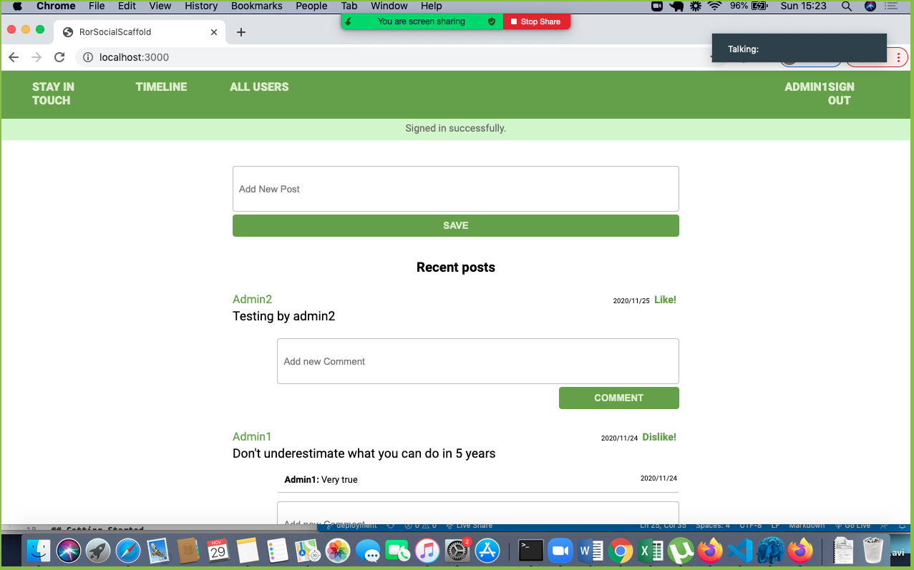

# Social Media App With Ruby on Rails

> This is an MVP for a social media app with basic styling and functionalities.
The features accomplished in this MVP are:
- for guest users:

    they are able to create account/log in.
    they can see only “Sign in” and “Sign out” page.

- for logged-in users:

    they can see all users list.
    they can see selected user page with their user name and all posts written by them (the most recent posts on the top).
    they can send a friendship invitation.
    they can see a button “Invite to friendship” next to the name of user who is not their friend yet - on both users’ list and single user page.
    they can see pending friendship invitations sent to them from other users.
    they can accept or reject friendships invitation.
    they can create new posts (text only).
    they can like/dislike posts (but they can like single post only once).
    they can add comments to posts.
    they can see “Timeline” page with posts (with number of likes and comments) written by them and all their friends (the most recent posts on the top).
    Timeline page should be the root page of the app.

## Screenshot


## Built With

- Ruby v2.6.5
- Ruby on Rails v5.2.4


## Getting Started

To get a local copy up and running follow these simple example steps.

### Prerequisites

Ruby: 2.6.5
Rails: 5.2.4
Postgres: >=9.5

### Setup

Install gems with:

```
bundle install
```

Setup database with:

```
   rails db:create
   rails db:migrate
```

### Usage

Start server with:

```
    rails server
```

Open `http://localhost:3000/` in your browser.

### Run tests

```
    rspec 
```


### Deployment

[Live link](https://fast-ravine-48156.herokuapp.com/)

## Authors

👤 Tazoh Yanick Tazoh

- GitHub: [@t-yanick](https://github.com/t-yanick)
- Twitter: [@ElTazoh](https://twitter.com/ElTazoh)
- Linkedin: [Tazoh Yanick](https://linkedin.com/in/tazoh-yanick)

👤 Mohamed Sabry

- Github: [@mohamedSabry0](https://github.com/mohamedSabry0)
- Twitter: [twitter profile](https://twitter.com/mohsmh0)
- Linkedin: [linkedin profile](https://www.linkedin.com/in/mohamed-sabry0/)


## 🤝 Contributing

Contributions, issues and feature requests are welcome!

Feel free to check the [issues page](https://github.com/mohamedSabry0/ror-social-scaffold/issues).

## Show your support

Give a ⭐️ if you like this project!

## Acknowledgments

- [Microverse](https://www.microverse.org/)

## 📝 License

This project is [MIT]() licensed.


